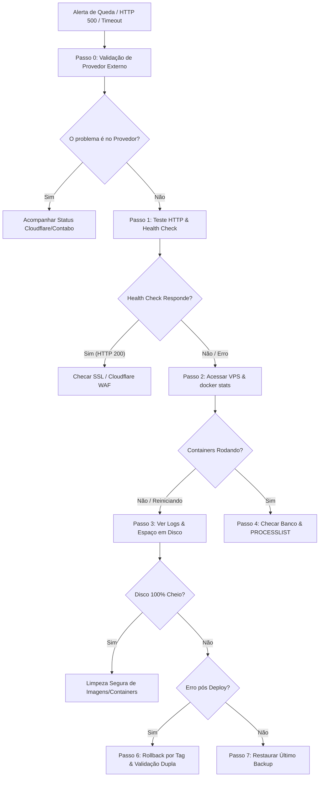

# 🚨 RUNBOOK OPERACIONAL DE INCIDENTES (`makisjeanty.com`)

> **Versão**: v1.0 (CONGELADO)  
> **"O site caiu às 3h da manhã — O que fazer?"**  
> Este guia é o manual prático de resposta rápida a incidentes para diagnosticar, mitigar e restabelecer o site `makisjeanty.com` em **menos de 30 minutos (RTO = 30 min)**.

---

## ⏱️ Fluxo Sequencial de Resposta a Incidentes



---

## 🌐 Passo 0: Validação de Provedor Externo (0 min)

Antes de alterar o ambiente da VPS, verifique se a indisponibilidade é um problema geral de infraestrutura externa:
1. **Cloudflare Status**: Acessar [cloudflarestatus.com](https://www.cloudflarestatus.com/)
2. **Contabo Status**: Acessar página de status do provedor de VPS.
3. **Conexão Local**: Confirmar se sua internet local está respondendo normalmente.

---

## 🔍 Passo 1: Triagem Rápida e Diagnóstico Inicial (0 a 3 min)

### 1. Testar o Endpoint de Saúde (`/health/`)
```bash
curl -i https://makisjeanty.com/health/
```
- **Resposta Esperada**: `HTTP 200 OK` com `{"status":"ok","database":"ok","redis":"ok","storage":"ok"}`.
- **Se retornar `HTTP 503` com `"database":"error"`**: O problema é o container MySQL.
- **Se retornar `HTTP 503` com `"redis":"error"`**: O problema é o container Redis.
- **Se der Timeout ou Erro 522 (Cloudflare)**: A aplicação na VPS está fora do ar ou o Nginx caiu.

### 2. Validar Certificado SSL/TLS
```bash
openssl s_client -connect makisjeanty.com:443 -servername makisjeanty.com
```

### 3. Acessar a VPS via SSH
```bash
ssh -i $HOME\.ssh\id_ed25519_makishub_vps makishub@195.26.252.210
```

---

## 🐳 Passo 2: Verificação de Containers Docker & Métricas (3 a 7 min)

Na VPS, navegue até a pasta do projeto e verifique o estado e métricas instantâneas:
```bash
cd /home/makishub/makis-home
docker compose ps
docker stats --no-stream
```

### Cenários Possíveis:
1. **Containers em estado `Restarting` ou `Exited`**:
   Execute para ver os últimos 100 logs do container com falha:
   ```bash
   docker logs --tail 100 makis_web
   docker logs --tail 100 makis_mysql
   ```
2. **Tentar reiniciar os containers**:
   ```bash
   docker compose restart
   ```

---

## 💾 Passo 3: Verificação de Disco e Limpeza Segura (7 a 10 min)

> [!CAUTION]
> **NUNCA execute `docker system prune -a --volumes -f` em um incidente!**  
> Remover volumes sem referência pode apagar dados não mapeados ou invalidar a imagem de rollback.

### 1. Identificar o Consumo Real do Sistema Docker
```bash
df -h /
docker system df
```

### 2. Limpeza Cirúrgica e Segura de Disco
Se a partição `/` estiver com uso > 95%, execute **apenas** a remoção segura de caches de compilação e imagens sem tag:
```bash
# Remover apenas containers parados, imagens pendentes e cache de build
docker image prune -f
docker container prune -f
docker builder prune -f
rm -rf /tmp/*
```

---

## 🛢️ Passo 4: Verificação do Banco de Dados e Processos (10 a 15 min)

### 1. Checar se o MySQL aceita conexões
```bash
docker exec makis_mysql mysqladmin -u root -p"${DB_ROOT_PASSWORD}" ping
```

### 2. Inspeção de Processos e Locks (`SHOW PROCESSLIST`)
Se o MySQL estiver "vivo" mas a aplicação não responder, verifique se há queries travadas ou deadlock:
```bash
docker exec makis_mysql mysql -u root -p"${DB_ROOT_PASSWORD}" -e "SHOW PROCESSLIST;"
```

### 3. Se o MySQL foi morto por falta de memória (OOM Killer)
```bash
dmesg -T | grep -i oom
docker compose restart db
docker compose restart web
```

---

## ☁️ Passo 5: Verificação da Cloudflare & Nginx (15 a 18 min)

1. **Testar resposta direta do Nginx local**:
   ```bash
   curl -I http://127.0.0.1:80
   ```
2. **Verificar WAF e Regras da Cloudflare**:
   - Acesse o painel da Cloudflare ➔ *Security / Events*.
   - Verifique se requisições legítimas não estão sendo bloqueadas pelo WAF ou por Challenge (Captcha).

---

## 🔄 Passo 6: Rollback por Tag de Release & Validação Dupla (18 a 22 min)

Se a queda ocorreu **logo após a publicação de um deploy recente**:

```bash
# 1. Alternar o código para a última tag de versão estável conhecida (ex: v1.0.0)
git checkout v1.0.0

# 2. Reconstruir e subir os containers
docker compose build
docker compose up -d

# 3. Validação Dupla Obrigatória (Local e Externa)
curl -i http://localhost:8000/health/
curl -i https://makisjeanty.com/health/
```

---

## 📦 Passo 7: Restauração de Emergência de Backup (22 a 30 min)

> [!IMPORTANT]
> **RPO = 24h | RTO = 30min**  
> A restauração utiliza o dump automatizado mais recente salvo em `/var/backups/makisjeanty/`.

```bash
# 1. Localizar o arquivo de backup de banco mais recente
LATEST_DB=$(ls -t /var/backups/makisjeanty/db_*.sql.gz | head -n 1)
gunzip -c "$LATEST_DB" | docker exec -i makis_mysql mysql -u root -p"${DB_ROOT_PASSWORD}" base_central

# 2. Restaurar arquivos de mídia mais recentes
LATEST_MEDIA=$(ls -t /var/backups/makisjeanty/media_*.tar.gz | head -n 1)
tar -xzf "$LATEST_MEDIA" -C /var/lib/docker/volumes/makishub_media_data/_data

# 3. Reiniciar a aplicação
docker compose restart web
```

---

## 📝 Passo 8: Registro Pós-Incidente & Lições Aprendidas

Após restabelecer a operação, responda às 5 perguntas de evolução operacional:
1. **O incidente poderia ser detectado antes?**
2. **O monitoramento ou alerta falhou?**
3. **O RUNBOOK precisa de atualização pontual baseada neste incidente real?**
4. **Deve ser criado um novo teste automatizado em `tests/`?**
5. **Existe alguma mudança arquitetural justificável para a próxima fase?**
