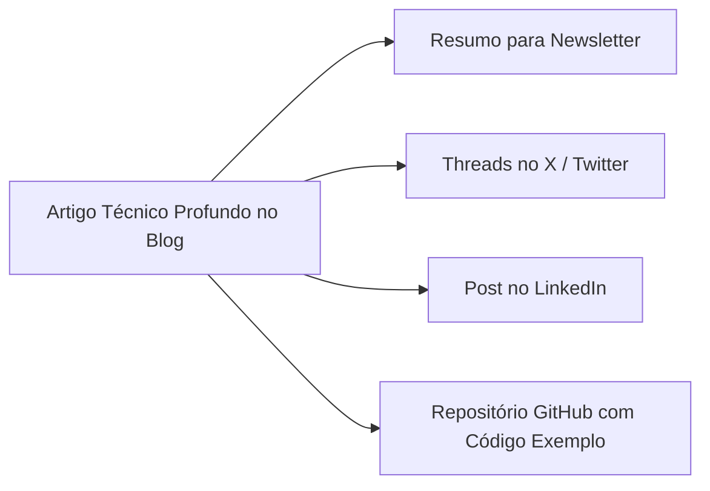

# ✍️ Pipeline de Conteúdo & Estratégia Editorial

## 1. Calendário e Frequência Editorial
- **Artigos Profundos (Blog)**: 2 por mês.
- **Newsletter Técnica**: Semanal ou quinzenal.
- **Postagens de Autoridade (LinkedIn/Twitter)**: 3 por semana.

## 2. Pautas Iniciais (Ideias em Produção)
1. **Artigo 1**: *Do Zero à Produção: Guia Definitivo para Hospedar Django + Docker em VPS de Baixo Custo*.
2. **Artigo 2**: *Arquitetura de Resposta a Incidentes: Como montar um RUNBOOK que funciona às 3h da manhã*.
3. **Artigo 3**: *Agentes Autônomos de IA em Python: Integrando LLMs com Arquiteturas Django Tradicionais*.
4. **Estudo de Caso**: *Como estruturei meu ecossistema de desenvolvimento usando a Regra 80/20*.

## 3. Fluxo de Publicação Multi-Canal

